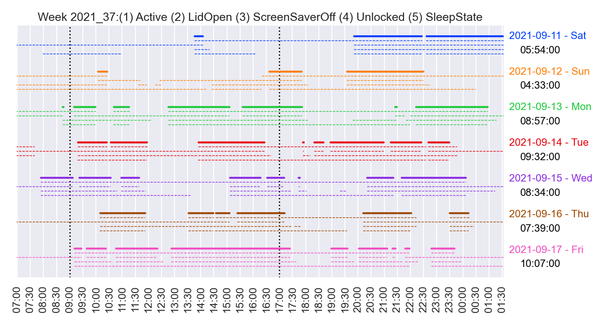

# xbar Screentime Tracker

This repository contains a script that can help to keep track of the time spent in front of your computer Everything relevant to do this is stored in the file `track_screentime.5min.py`. The recommended way to use this script is to combine it with [xbar](https://github.com/matryer/xbar), an application for Mac OS X which allows the printing of output directly into the menu bar.

## Purpose

The purpose of the screentime tracker script is rather simple, to track the **active** time spent in front of your computer. The goal is to give you a better feedback how much you've already worked to better judge when the workday is over, and when you've worked too much or not enough.

The application has two ways to provide the information about the screen time. (1) Directly via the menubar (using the xbar application) or (2) via informative plots.

### Menu bar indication of screen time

To help with the indication of how much of a workday has past, the application indicates the screentime **shown in the menu bar** in 4 different colors:

- : While the day is still fresh (e.g. between 0h and 4.1h), the active time spent in front of the computer is shown in blue.
- : While the day is in its second half (e.g. between 4.1h and 8.2h), the active time spent in front of the computer is shown in green.
- : While the day is closing (e.g. between 8.2h and 9h), the active time spent in front of the computer is shown in yellow.
- : When you've worked too much (e.g. after 9h), the active time spent in front of the computer is shown in red.

### Visual overview (daily and weekly) of screen time

To provide a visual overview of how much time you've spent active in front of your computer, this script creates two kind of plots. Both of them are accessible through the dropdown menu in the xbar section in the menubar:

Additionally, both of these figure types will be created on a daily (for the "Stats Today") and weekly (for the "Overview Week") basis and stored in a folder called `screentime_log` in your home folder, i.e. `~/screentime_log/`.

Both plots show information about five different kind of system log events:

- **LidOpen**: Time during which the MacBook lid was open
- **ScreenSaverOff**: Time during which the Screen Saver wasn't running
- **Unlocked**: Time during which the notebook was unlocked
- **WakeState**: Time during which notebook was awake
- **Active**: Product of the four metrics above, i.e. time when you were actively working.

#### Daily screentime plot

The daily screen time plot shows you detailed information about the 5 states mentioned above and summarizes on the right from when to when you were actively working, plus what the cummulative sum of these screen times is.

#### Weekly screentime plot

The weekly screen time plot shows you the same information as the daily screen time plot, starting from Saturday the week before. The only difference to the daily plot is the detailed information of the indiviudal screen time blocks.

## Configuration

Adaptations of the screentime tracker script can be done directly in the script `track_screentime.5min.py`.

**`screensaver_offset='10m'`**

Whenever the screensaver status is switching from off to on, i.e. when the screensaver starts showing, the script has to calculate the respective time window backwards to know when you've left your screen. For this reason, I recommend to use a reasonably small (and comfertably big) time periods until the screen saver starts. Should this time duration be different than 10min, please adapt the default parameter of the `read_log_files` function from `screensaver_offset='10m'` to the actual time duration.

**`dayshift='5h'`**

Sometimes you might work longer than midnight, in which case these additionally spent hours in the already new day should be accounted for in your previous (and still active day). To counter the switch to the new day at midnight, the parameter `dayshift='5h'` was introduced in the `unite_information` function. By default, the new day is reset at 05:00, please change this value should that not be reasonable for you.

Additionally, you can also changing the time interval in which the script updates the output of the script by chaning the second part of the file name `track_screentime.5min.py`, i.e. the string `5min`. By default the script is updated every 5 minutes, however a smaller or bigger time interval chan be chosen if desired.

## Installation

The easiest way to run this script in the background is to use the [xbar](https://github.com/matryer/xbar) application. As this application is restricted to Mac OS X, the installation here is restricted to this OS, however the script `track_screentime.5min.py` should run on any OS which supports bash.

The following instruction are focused on how to make this script run on a Mac OS X using the xbar application:

1. Install xbar application as described [here](https://github.com/matryer/xbar#installing-xbar), either via the terminal or by installing it as an application.
2. Create a plugin folder to store xbar scripts, in our case this is under `~/xbar` or `/Users/username/xbar`.
3. Download script `track_screentime.5min.py` from this repository and store it in the xbar plugin folder mentioned in the previous point.
